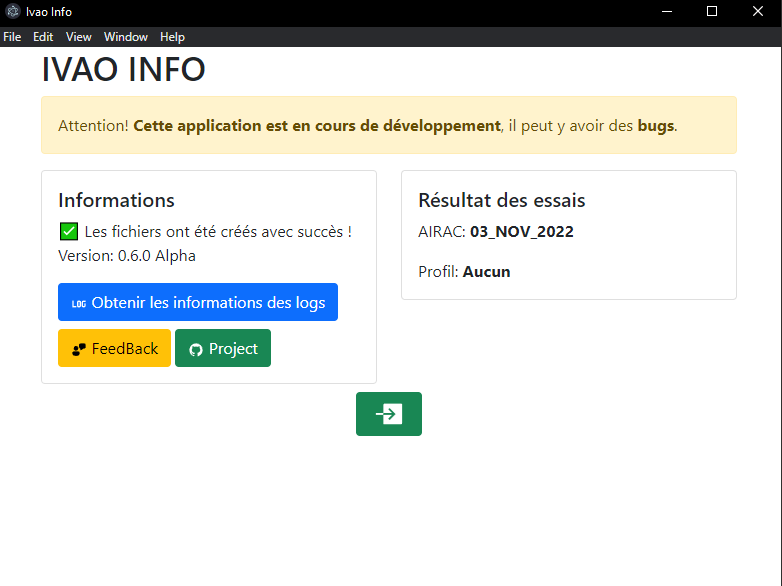

# Ivao-Info Tracker

Logiciel de tracker pour [IVAO](https://www.ivao.aero/)

## Documentation

La documentation est disponible sur le depot de GitHib [ivao-info](https://github.com/alexcaussades/ivao-info/tree/master/docs)

## RGPD

>Le RGPD impose au développer du logciel de mettre en place des mesures de sécurité pour protéger les données personnelles des utilisateurs. Il est donc nécessaire de créer un profile pour pouvoir utiliser le logiciel.

### Utilisation des données
Les données sont utilisées pour :

A des fins recherche sur les services de IVAO.

**Elle sont stocker sur votre ordinateur et ne sont pas envoyé sur un serveur**.