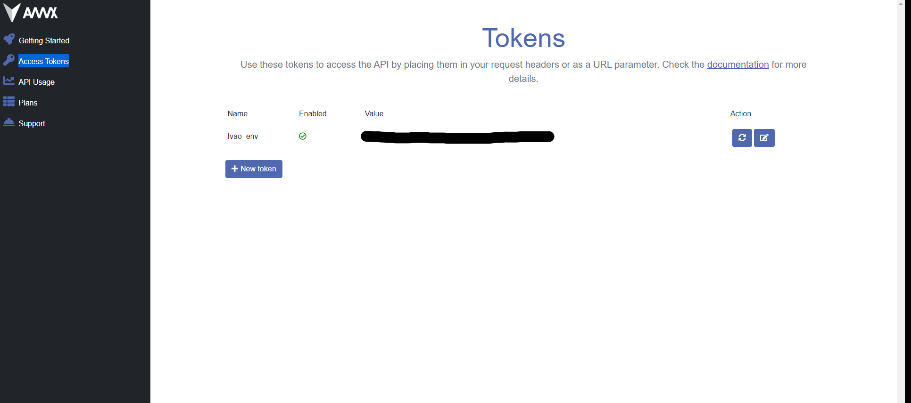

# Creation du token pour le metar

## Connection au serveur

Récupère les informations météo d'un aéroport.

Conneter à l'API de [avwx](https://account.avwx.rest/login) et pour récupèrer les informations météo d'un aéroport suivre les instructions ci-dessous.

## Création du token

Pour créer un token, il faut se connecter à [Access Tokens](https://account.avwx.rest/tokens) et créer un token.

## Utilisation du token

Pour utiliser le token, il faut le mettre dans votre `Profile` dans Ivao-Info.

