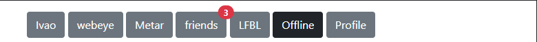
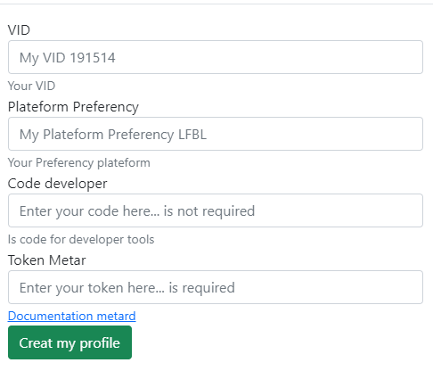

# Your profile

## Creation du profile

La creation du profile se fait avec le button `profile` dans la barre de menu.

## Ajout des informations

Remplissez les champs avec les informations que vous avez récupéré.

## Token pour le metar

Suivre les instructions de la documentation [metar](./metar.md)

# Pourquoi Crée un profile dans le logiciel ?

Pour avoir accès à toutes les fonctionnalités du logiciel, il est nécessaire de créer un profile.

## Reglementation RGPD : 

> Le RGPD impose au développer du logciel de mettre en place des mesures de sécurité pour protéger les données personnelles des utilisateurs. Il est donc nécessaire de créer un profile pour pouvoir utiliser le logiciel.

### Utilisation des données

Les données sont utilisées pour :

A des fins recherche sur les services de IVAO.

**Elle sont stocker sur votre ordinateur et ne sont pas envoyé sur un serveur**.

